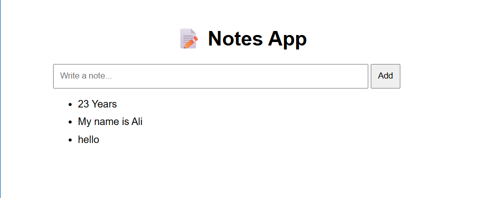

* (SIMPLE UI AND FOCUSING ON THE ARCHITECTURE OF BUILDING AS DEVOPS ENGINEER)

# Notes App - DevOps K8S Environment 
**************************************
Notes application deployed using Docker and Kubernetes, demonstrating real-world DevOps practices.

Architecture
***************
user ----> Ingress ----> Service ----> Pod (Nginx & Node.js) ----> Postgresql ----> Persistent volume

Tech stack I used
********************
1) Node.js (Backend API)
2) PostgreSQL (Database)
3) Docker (Containerization)
4) Kubernetes (Orchestration)
5) Nginx (Reverse Proxy)
6) ConfigMap & Secret (Configuration Management)

Features
************
1) Multi-container Pod (Nginx + App)
2) Kubernetes Services & Networking
3) Ingress-based routing
4) Persistent storage (PV + PVC)
5) Secure credentials using Secrets

Key Learnings
*****************
1) Kubernetes networking (Service vs Ingress)
2) Multi-container Pods (sidecar pattern)
3) Config vs Secret separation
4) Persistent storage in Kubernetes
5) Debugging real DevOps issues

UI Preview
*************

